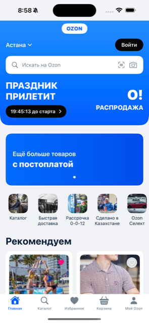
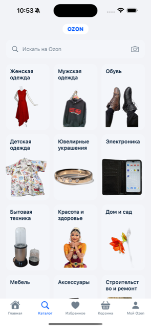
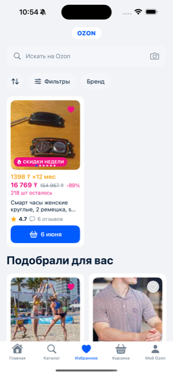
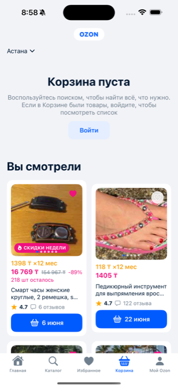

# Ozon-Style iOS

A Russian-language e-commerce storefront built in SwiftUI for iOS 17+, recreating the OZON marketplace UI from a spec + 5 reference screenshots. Structured with **MVVM-C** (Model · View · ViewModel · Coordinator): five tabs, one reusable product card, per-tab navigation stacks, zero dependencies.

---

## Screenshots

| Home (Главная) | Catalog (Каталог) | Favorites (Избранное) |
|----------------|-------------------|-----------------------|
|  |  |  |

| Cart (Корзина) | Profile (Мой Ozon) |
|----------------|--------------------|
|  |  |

---

## Tech Stack

| Layer | Technology |
|-------|-----------|
| UI | SwiftUI (iOS 17) |
| Architecture | MVVM-C — Model · View · ViewModel · Coordinator |
| State | `ObservableObject` ViewModels (`@Published`), one per screen |
| Navigation | Per-tab `Coordinator` owning a `NavigationStack` path + `AppRoute` |
| Data | `ProductRepository` protocol → `SampleDataRepository` (DI seam) |
| Images | Asset-catalog imagesets + `ProductImage` placeholder fallback |
| Project | XcodeGen (`project.yml`) |
| Dependencies | None |

---

## Architecture

**MVVM-C.** Each layer has one job and one dependency direction (top → down):

- **Coordinator** — `AppCoordinator` is the composition root: it builds the single
  repository, all five ViewModels, and five `TabCoordinator`s once, and holds the
  selected-tab state. Each `TabCoordinator` owns its tab's `NavigationStack` path
  and exposes navigation intent (`show(_ product:)`); a `CoordinatedStack` wrapper
  binds the path and registers `AppRoute → destination`.
- **ViewModel** — one `@MainActor ObservableObject` per screen, exposing
  `@Published` state. Depends only on the `ProductRepository` protocol. Owns screen
  logic (e.g. the Home carousel index + auto-advance).
- **View** — SwiftUI screens render ViewModel state and forward user intent (a
  product tap) to the coordinator via an `onSelectProduct` closure. No data literals.
- **Model** — domain types behind `ProductRepository`; `SampleDataRepository`
  supplies the in-memory `SampleData` fixtures (still the single source of truth),
  swappable for a network/DB layer without touching any View or ViewModel.

### Layer overview

```
┌──────────────────────────────────────────────────────────┐
│  OzonStyleApp  @main · @StateObject AppCoordinator        │
│                                                           │
│  AppCoordinator (composition root)                        │
│    ├─ ProductRepository  (SampleDataRepository)           │
│    ├─ 5 ViewModels   (Home · Catalog · Favorites …)       │
│    ├─ 5 TabCoordinators (NavigationPath each)             │
│    └─ selectedTab                                         │
└───────────────────────────┬──────────────────────────────┘
                            │ injects VM + show() closure
        ┌───────────────────┴───────────────────────────────┐
        │  RootTabView → CoordinatedStack (NavigationStack)  │
        │  Screens: Home · Catalog · Favorites · Cart ·      │
        │  Profile   →  push  AppRoute.productDetail         │
        └───────────────────┬───────────────────────────────┘
        View → VM (@Published)│ · View → Coordinator (intent)
        ┌───────────────────┴───────────────────────────────┐
        │  ViewModels  (ObservableObject, @MainActor)        │
        │  read via ↓                                        │
        │  ProductRepository  ←  SampleData (single source)  │
        └────────────────────────────────────────────────────┘
                    composed of ↑ Components (ProductCard …)
```

### The keystone rule — one card, every surface

A single `ProductCard` renders every product across all screens. Variants change
only the **outer width**, never the internal layout.

```
ProductCard(product:variant:)
  variant ─┬─ .grid           → fills a 2-col grid cell   (Home/Favorites/Profile)
           ├─ .viewedGrid      → fills a 2-col grid cell   (Cart "Вы смотрели")
           └─ .featuredCompact → grid-card width, screen wraps HStack{card; Spacer()}
                                                          (Favorites featured)

internal layout (identical for all variants):
  image (1:1, heart · badge · page-dots)
    → PriceBlock (installment / sale+old+discount / urgency)
    → title (2-line)
    → RatingRow (★ rating · ru-pluralized review count)
    → CTAButton (basket + delivery date)
```

### Design tokens (single source)

```
DesignSystem/
  Color+Tokens.swift   12 semantic colors, asset-catalog backed
                       (declared on ShapeStyle where Self == Color so
                        `.foregroundStyle(.token)` resolves)
  Layout.swift         gutter=16 global · grid math computed, never eyeballed
  Typography.swift     10 fixed-size system styles
  Brand.swift          OZON wordmark + brand colors isolated here
```

### Brand isolation

All OZON identity (wordmark, brand colors, hero lockup colors) lives in
`Brand.swift`. Screens reference `Brand.*`, never the literal `"OZON"` string or
brand hex — so the identity can be swapped without touching any screen.

---

## Project Structure

```
OzonStyle/
├── App/
│   ├── OzonStyleApp.swift        @main, @StateObject AppCoordinator, tab-bar appearance
│   └── RootTabView.swift         5-tab TabView, each tab a CoordinatedStack
├── Coordinators/
│   ├── AppCoordinator.swift      composition root + TabCoordinator + CoordinatedStack
│   └── AppRoute.swift            navigation routes (→ ProductDetailScreen)
├── ViewModels/
│   ├── HomeViewModel.swift       banners/quick-actions/recommended + carousel
│   ├── CatalogViewModel · FavoritesViewModel
│   └── CartViewModel · ProfileViewModel
├── Services/
│   └── ProductRepository.swift   protocol + SampleDataRepository (DI seam)
├── DesignSystem/
│   ├── Color+Tokens.swift        12 semantic colors
│   ├── Layout.swift              spacing / corner constants + grid math
│   ├── Typography.swift          10 type styles
│   └── Brand.swift               wordmark + brand colors (isolated)
├── Models/
│   ├── Product.swift             Product + ProductBadge
│   ├── Category.swift  QuickAction.swift  SettingsItem.swift
│   └── SampleData.swift          ALL mock content
├── Components/
│   ├── ProductCard.swift         keystone (+ ProductCardVariant)
│   ├── PriceBlock · RatingRow · CTAButton
│   ├── SearchBar · ProductImage · CategoryCard
│   ├── FilterChip (Sort + Filter) · QuickActionTile
│   ├── SettingsRow · SectionHeader · PrimaryButton (+ SoftButton)
│   └── AppLogoHeader.swift        centered brand pill
├── Screens/
│   ├── HomeScreen.swift           gradient header + hero + carousel + grid
│   ├── CatalogScreen.swift        3-col category grid
│   ├── FavoritesScreen.swift      filter row + compact featured + grid
│   ├── CartScreen.swift           empty-state band + "Вы смотрели"
│   ├── ProfileScreen.swift        two grouped sections + settings
│   └── ProductDetailScreen.swift  pushed destination (reuses product components)
└── Resources/
    └── Assets.xcassets            12 color sets · AppIcon · 30 imagesets
```

---

## Setup

### Prerequisites

- Xcode 16+ (built with Xcode 26.5), iOS 17 simulator
- [XcodeGen](https://github.com/yonaskolb/XcodeGen): `brew install xcodegen`

### Steps

```bash
git clone <repo>
cd Ozon-SwiftUI-iOS-Russian-Ecommerce-Market-App

xcodegen generate          # regenerates OzonStyle.xcodeproj
open OzonStyle.xcodeproj
```

The project has **no third-party packages** — it builds and runs as-is.

---

## Design fidelity & validation

Verified against the 5 reference screenshots on an iPhone 15 Pro Max simulator.
The gate is visual fidelity + **8 binary red-lines** (full report in
[`docs/implementation/validation-report.md`](docs/implementation/validation-report.md)):

| # | Red-line | Status |
|---|----------|--------|
| 1 | Logo pill always below the safe area | ✅ |
| 2 | Favorites featured card compact + left-aligned (never full-width) | ✅ |
| 3 | Cart empty state is a full-width band (not an inset card) | ✅ |
| 4 | Profile = two separate grouped sections | ✅ |
| 5 | Catalog has the centered logo | ✅ |
| 6 | Home hero lives inside the gradient header | ✅ |
| 7 | One shared `Product` model + single `ProductCard` (no inline tiles) | ✅ |
| 8 | Brand wordmark/colors never hardcoded in screen views | ✅ |

---

## Known constraints (v1 prototype)

- **Mostly inert** — search bars, hearts, chips, CTAs, settings rows, and login
  buttons render fully but do nothing on tap. Interactive paths: tab switching, and
  tapping any product card pushes `ProductDetailScreen` via its tab coordinator.
- **Placeholder imagery** — product/category photos are low-res keyword-matched
  stand-ins (`ProductImage` falls back to a `photo` glyph when an asset is
  missing). Bundle imagery is intentionally small (~150 KB total).
- **Fixed-size type** — fonts use fixed point sizes for exact pixel fidelity to
  the fixed-size reference; text does not scale with Dynamic Type.
- **IP** — the OZON wordmark, the О!РАСПРОДАЖА hero lockup, and the third-party
  stand-in photos are isolated in `Brand.swift` + the asset catalog and should be
  swapped before any non-prototype use.

---

## Documentation

Spec-first docs that drove the build live in [`docs/`](docs/):
research, requirements, design-system, design, architecture, implementation-plan,
validation-plan, validation-report, and the developer prompt.
